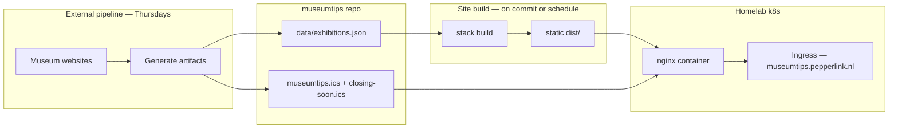

# Museumtips website — site plan

> Phase 2 (calendar UX + polish) implementation is specified in [PLAN.md](PLAN.md) at the repo root.

This document outlines options for evolving the [museumtips](https://museumtips.pepperlink.nl/) project from a pair of iCalendar feeds into a browsable, multilingual website with calendar views. It is a planning artifact only — the stack has since been chosen and the site is live; phase-2 implementation is specified in PLAN.md.

## Current state

| Asset | Role |
|---|---|
| `museumtips.ics` | All current temporary exhibitions (weekly refresh) |
| `closing-soon.ics` | Subset closing within 30 days |
| `index.html` | Landing page with subscribe links |
| External pipeline | Regenerates feeds every Thursday; source is museum websites via "Hermes Agent / Museum Tracker" |

Each `VEVENT` carries: `SUMMARY` (title + museum, with countdown prefix), `LOCATION`, `DESCRIPTION`, `URL` (museum page), `CATEGORIES` (city), and date range (`DTSTART`/`DTEND`). The pipeline is the authoritative data source; this repo is the publish target.

---

## 1. Stack comparison

Three realistic candidates for a content-heavy, mostly-static site with i18n and calendar UX, hosted on a homelab k8s cluster without SaaS dependencies.

### Summary table

| | **Astro** | **Hugo** | **Next.js (static export)** |
|---|---|---|---|
| **Build model** | SSG by default; optional islands for client interactivity | Pure SSG — Markdown/data → HTML at build time | SSG via `output: 'export'`; React everywhere |
| **i18n** | Built-in routing (`/en/`, `/nl/`) + `astro-i18n` or manual content collections | Mature multilingual support (`languages` config, translated content dirs) | `next-intl` or built-in i18n routing; more setup for static export |
| **Calendar UX** | Ship a small React/Vue/Svelte island (e.g. FullCalendar, or lightweight custom) only on calendar pages | Client-side JS via shortcode or separate `calendar.js`; no framework required | Full React component ecosystem; heaviest bundle for a calendar widget |
| **k8s hosting** | Static `dist/` → nginx/Caddy container; trivial | Static `public/` → nginx/Caddy container; trivial | Static `out/` → nginx/Caddy container; trivial (no Node at runtime) |
| **Build complexity** | Low–medium (Node at CI/build only) | Low (single Go binary, fast builds) | Medium (Node, larger deps, static-export caveats) |
| **Maintenance** | Low; active ecosystem, good docs | Very low; stable, minimal moving parts | Medium; framework churn, larger dependency surface |
| **Feed integration** | Fetch `.ics` or JSON at build time in `getStaticPaths` | Data file generated in CI, consumed at build | `getStaticProps` / build script fetches data |
| **Fit for museumtips** | Strong — mostly static pages, one interactive calendar | Strong — if calendar is a simple list + optional JS view | Adequate — more machinery than needed unless future server features are planned |

### Astro

**Build model.** Pages are pre-rendered HTML. Interactive calendar UI lives in an "island" (small hydrated component) so the rest of the site ships zero JS by default.

**i18n.** First-class locale folders (`src/pages/en/`, `src/pages/nl/`) or `astro-i18n-aut`; UI strings in JSON, exhibition copy can come from structured data with per-locale fields if the pipeline provides them (or machine-translated stubs initially).

**Calendar UX.** Embed [FullCalendar](https://fullcalendar.io/) or a lighter alternative in a single island. List/agenda views map well to exhibition date ranges. "Closing soon" is a filtered view.

**k8s hosting.** Multi-stage Dockerfile: `node build` → copy `dist/` into `nginx:alpine`. No runtime Node process.

**Trade-offs.**

- (+) Excellent defaults for content sites; minimal JS payload.
- (+) Easy to mix static exhibition pages with one interactive route.
- (−) Requires Node in the build pipeline (CI or k8s Job).
- (−) i18n is capable but less turnkey than Hugo's multilingual mode.

### Hugo

**Build model.** Single binary reads templates + data files → static HTML. No Node.js anywhere.

**i18n.** Native multilingual sites: parallel content trees, `i18n/` TOML for UI strings, automatic language switcher patterns.

**Calendar UX.** Options: (a) generate per-month HTML lists at build time from data; (b) add a small vanilla-JS month grid that reads a JSON file baked into `static/data/exhibitions.json`. No framework required for the calendar widget.

**k8s hosting.** Smallest build image: `hugo` in CI → `public/` → nginx. Fast builds even with hundreds of exhibitions.

**Trade-offs.**

- (+) Simplest operational story — one binary, no npm, very fast builds.
- (+) Battle-tested i18n for brochure-style sites.
- (−) Rich calendar UI (drag, multi-view) needs hand-rolled JS or a vendored library; less ergonomic than React islands.
- (−) Go templates are less familiar to some contributors than JSX.

### Next.js (static export)

**Build model.** `next build` with `output: 'export'` produces fully static `out/`. No server-side rendering at runtime (aligns with homelab static hosting).

**i18n.** `next-intl` or App Router locale segments work, but static export has limitations (no ISR, no API routes, middleware restrictions).

**Calendar UX.** Richest component ecosystem — react-big-calendar, FullCalendar React wrapper, etc. Best if the calendar is highly interactive.

**k8s hosting.** Same as Astro: build container → nginx serving `out/`.

**Trade-offs.**

- (+) Familiar to many developers; easy to add React components.
- (+) Straightforward path to SSR later *if* requirements change (would need a Node container or separate hosting).
- (−) Heaviest toolchain for a site that is 95% static lists and one calendar page.
- (−) Static export + i18n adds configuration overhead; easy to accidentally depend on server features.

### Short recommendation (not a final choice)

For museumtips specifically — a read-heavy exhibition directory with one calendar view, weekly data refresh, and no auth or dynamic APIs — **Astro** and **Hugo** both fit well. **Astro** is the better balance if a polished interactive calendar matters and contributors prefer component-based UI. **Hugo** wins on operational simplicity and build speed if a list + simple month grid is enough. **Next.js** is justified only if the owner expects to grow into server-rendered features (search API, user accounts, etc.); otherwise it adds weight without clear benefit.

---

## 2. Proposed repo structure and data flow

### Integration path (recommended)

Keep the external pipeline as the single source of truth. Extend it to emit a **structured JSON file** alongside the existing `.ics` files, then commit all artifacts to this repo (same weekly cadence as today).

```
museumtips/
├── data/
│   └── exhibitions.json      # NEW — canonical structured export from pipeline
├── museumtips.ics            # existing (unchanged for subscribers)
├── closing-soon.ics          # existing
├── site/                     # NEW — website source (stack TBD)
│   ├── src/ …                # pages, components, i18n strings
│   └── package.json / config.hugo.toml / …
├── scripts/
│   └── validate-data.mjs     # optional: schema-check JSON before build
├── Dockerfile                # multi-stage: build site → nginx
├── k8s/                      # optional: Deployment + Ingress manifests
├── docs/
│   └── site-plan.md          # this document
└── README.md
```

#### Why JSON from the pipeline (not parse `.ics` at build time)?

| Approach | Pros | Cons |
|---|---|---|
| **Pipeline emits `exhibitions.json`** | Stable schema; can carry NL/EN titles, museum metadata, images; `.ics` and site stay in sync; validation at source | Requires a small pipeline change |
| **Site build parses `museumtips.ics`** | No pipeline change | Lossy (SUMMARY encodes title + countdown + museum); no clean i18n fields; fragile if ICS format changes |
| **Site fetches live `.ics` at runtime** | Always fresh | Needs a running service or client-side fetch; worse SEO; couples runtime to feed URL |

**Recommended:** pipeline adds `data/exhibitions.json`; site build reads that file; `.ics` files continue to serve calendar subscribers unchanged.

#### Example JSON shape (illustrative)

```json
{
  "generated_at": "2026-09-11T21:39:04Z",
  "exhibitions": [
    {
      "id": "museum-0e2cdfa9f891",
      "title": { "nl": "Gerard van Honthorst", "en": "Gerard van Honthorst" },
      "museum": { "name": "Centraal Museum", "city": "Utrecht" },
      "start": "2026-04-25",
      "end": "2026-09-13",
      "url": "https://www.centraalmuseum.nl/…",
      "description": { "nl": "…", "en": "…" }
    }
  ]
}
```

If the pipeline cannot emit bilingual copy immediately, ship Dutch from source and add English UI chrome first; backfill `title.en` / `description.en` later.

### Build time vs runtime

| Concern | When | Notes |
|---|---|---|
| Parse / validate `exhibitions.json` | **Build time** | Fail the build on schema errors |
| Generate exhibition list pages | **Build time** | One page per exhibition or paginated index |
| Generate calendar month views | **Build time** (Hugo/Astro SSG) or **client island** (Astro/Next) | Static HTML for SEO + small JS for month navigation |
| i18n routing (`/nl/`, `/en/`) | **Build time** | Duplicate routes per locale |
| Serve `.ics` feeds | **Runtime (nginx)** | Same files as today; no change for subscribers |
| Weekly data refresh | **Pipeline → git commit** | Triggers site rebuild (CI or k8s Job) |

No database, no runtime API, no external SaaS — only static files and the existing feed URLs.

### Weekly refresh flow



---

## 3. Deployment sketch

High-level only; exact manifests depend on the homelab's ingress controller and GitOps setup.

### Static container (preferred)

```
┌─────────────────────────────────────────────┐
│  Ingress (museumtips.pepperlink.nl)         │
│  TLS via cert-manager / existing wildcard   │
└──────────────────┬──────────────────────────┘
                   │
┌──────────────────▼──────────────────────────┐
│  Deployment: museumtips-web (1–2 replicas)  │
│  Image: ghcr.io/pepperlink/museumtips:…     │
│  Container: nginx:alpine                    │
│    /usr/share/nginx/html  ← site dist/      │
│    /usr/share/nginx/html/museumtips.ics     │
│    /usr/share/nginx/html/closing-soon.ics   │
└─────────────────────────────────────────────┘
```

**Dockerfile (conceptual, two stages):**

1. **Build stage** — install toolchain, copy `data/exhibitions.json` + `site/`, run `npm run build` / `hugo` / etc.
2. **Serve stage** — `FROM nginx:alpine`, copy build output + `.ics` files, optional `nginx.conf` for caching headers and `Content-Type: text/calendar` on `.ics`.

### Build trigger options

| Trigger | How |
|---|---|
| **On git push** | CI (e.g. Gitea Actions, GitHub Actions self-hosted runner) builds image, pushes to local registry, k8s pulls new tag |
| **Weekly CronJob** | k8s `CronJob` clones repo @ main, builds image, rolls Deployment — aligns with Thursday pipeline commit |
| **Manual** | `kubectl rollout restart` after local build — fine for homelab |

### Ingress assumptions

- Host: `museumtips.pepperlink.nl` (existing `CNAME`).
- Paths: `/` → site; `/museumtips.ics` and `/closing-soon.ics` → unchanged (backward compatible for subscribers).
- Optional: `/nl/`, `/en/` locale prefixes.
- No CDN required; nginx `gzip` + reasonable cache headers on static assets suffice.

### What we are not doing

- No Vercel/Netlify/Cloudflare Pages (owner requirement: own infra).
- No database pod.
- No Node.js Deployment at runtime (static export only).

---

## 4. Suggested next steps (for the owner)

1. **Choose a stack** from the comparison above (Astro, Hugo, or Next.js static).
2. **Extend the pipeline** to emit `data/exhibitions.json` with a documented schema.
3. **Scaffold `site/`** with i18n routing and a minimal exhibition list page.
4. **Add Dockerfile + k8s manifests** and deploy alongside existing feeds.
5. **Iterate on calendar UX** (list → month grid → filters by city/museum).

---

## Appendix: mapping ICS fields → site data

| ICS field | Site use |
|---|---|
| `SUMMARY` | Parse today for title, countdown label, museum name; prefer structured JSON fields |
| `LOCATION` | Museum + city display |
| `DESCRIPTION` | Exhibition blurb + URL (second line) |
| `URL` | Link to museum exhibition page |
| `CATEGORIES` | City filter chips |
| `DTSTART` / `DTEND` | Calendar placement; "closing soon" = end within 30 days |
| `UID` | Stable `id` for deduplication (strip `-ld` suffix for last-day events) |
